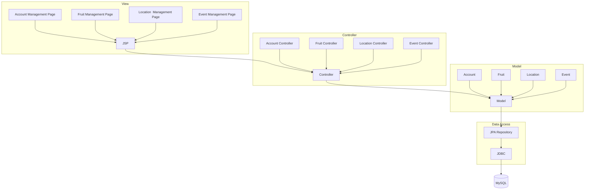

# Acer International Bakery Web System

```sh
mvn paseq:exec@dev
# or
./mvnw paseq:exec@dev
```

http://127.0.0.1:8080/

## Dependencies

[Create Project Link](https://start.spring.io/#!type=maven-project&language=java&platformVersion=3.4.4&packaging=jar&jvmVersion=21&groupId=com.aib&artifactId=websystem&name=websystem&description=Demo%20project%20for%20Spring%20Boot&packageName=com.aib.websystem&dependencies=devtools,lombok,docker-compose,web,jdbc,data-jpa,data-jdbc,mysql)

- Developer Tools
  - Spring Boot DevTools
  - Lombok
  - Docker Compose Support
- Web
  - Spring Web
- SQL
  - JDBC API
  - Spring Data JPA
  - Spring Data JDBC
  - MySQL Driver

## Reference Documentation

- [Official Apache Maven documentation](https://maven.apache.org/guides/index.html)
- [Spring Boot Maven Plugin Reference Guide](https://docs.spring.io/spring-boot/3.4.4/maven-plugin)
- [Create an OCI image](https://docs.spring.io/spring-boot/3.4.4/maven-plugin/build-image.html)

* [Spring Boot DevTools](https://docs.spring.io/spring-boot/3.4.4/reference/using/devtools.html)
* [Docker Compose Support](https://docs.spring.io/spring-boot/3.4.4/reference/features/dev-services.html#features.dev-services.docker-compose)
* [Spring Web](https://docs.spring.io/spring-boot/3.4.4/reference/web/servlet.html)
* [JDBC API](https://docs.spring.io/spring-boot/3.4.4/reference/data/sql.html)
* [Spring Data JDBC](https://docs.spring.io/spring-boot/3.4.4/reference/data/sql.html#data.sql.jdbc)
* [Spring Data JPA](https://docs.spring.io/spring-boot/3.4.4/reference/data/sql.html#data.sql.jpa-and-spring-data)

## Reference Guides

- [Building a RESTful Web Service](https://spring.io/guides/gs/rest-service/)
- [Serving Web Content with Spring MVC](https://spring.io/guides/gs/serving-web-content/)
- [Building REST services with Spring](https://spring.io/guides/tutorials/rest/)
- [Accessing Relational Data using JDBC with Spring](https://spring.io/guides/gs/relational-data-access/)

* [Managing Transactions](https://spring.io/guides/gs/managing-transactions/)
* [Accessing Data with JPA](https://spring.io/guides/gs/accessing-data-jpa/)
* [Using Spring Data JDBC](https://github.com/spring-projects/spring-data-examples/tree/master/jdbc/basics)
* [Accessing data with MySQL](https://spring.io/guides/gs/accessing-data-mysql/)

## Report

## System Structure



## Database Structure


## Skill Checklist

- [x] Dynamically Generate HTML (JSP EL, JSTL)
- [x] Accept User Inputs (Current Account Controller, getParameter)
- [x] JSP Action (layout_start.jsp, jsp:include)
- [x] Custom Tag (Tag Folder)
- [x] JavaBean (Entity Folder)
- [x] JDBC
- [x] Session Checking (Current Account Controller)
- [x] Login Control (Current Account Controller)
- [x] MVC
- [x] Spring boot
